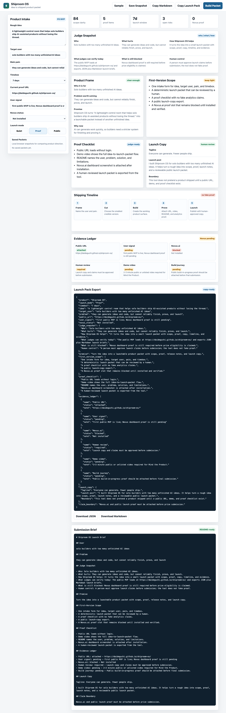
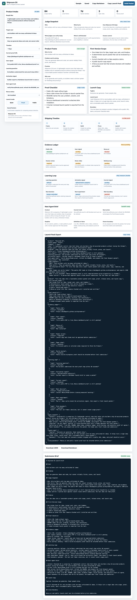

# Shiproom OS

Shiproom OS is a shipping control room for solo builders.

Everyone can generate ideas now. The hard part is finishing, proving, and launching a product. Shiproom OS turns a rough idea into a launch packet that a human can review:

- target user
- problem statement
- tight first-version scope
- proof checklist
- launch copy
- shipping timeline
- JSON launch-pack export
- Markdown submission brief
- saved local packet history
- evidence ledger
- learning loop for post-launch signals
- next-agent handoff brief
- analytics / Novus proof slot
- judge snapshot answering who, what, how, proof, and human-control boundaries

## Judge Quick Read

Who it helps: solo builders and tiny teams who can start many ideas but struggle to finish one cleanly.

The problem: AI makes drafts cheap, but it does not automatically create a tight scope, proof plan, launch copy, evidence, or a handoff another person can trust.

How Shiproom OS solves it: the app turns one rough idea into a structured launch packet with scope, proof, copy, timeline, evidence, learning loop, and next-agent handoff.

What is proven now: the public app, screenshots, demo video draft, local verifier, claim-boundary verifier, and submission docs are live. Novus/Pendo proof is intentionally blocked until a real dashboard screenshot exists.

## Live Demo

```text
https://daideguchi.github.io/shiproom-os/
```

## Demo Media

Current live screenshot:



Current local verification screenshot:



Demo video status: pending. Do not submit the Mind the Product entry until the 2-3 minute video, public URL, Novus/Pendo dashboard proof, and build journey all agree.

Current local demo video:

```text
media/shiproom-os-demo.mp4
```

Raw demo video URL:

```text
https://raw.githubusercontent.com/daideguchi/shiproom-os/main/media/shiproom-os-demo.mp4
```

This is a generated narration draft for review. It is not a final public YouTube/Devpost video until DD approves and the Novus/Pendo proof boundary is resolved.

## Quick Start

Open `index.html` in a browser.

## Verify

```bash
node scripts/verify_shiproom.mjs
python3 scripts/verify_claim_boundary.py
python3 scripts/verify_demo_video.py
```

Expected:

```text
shiproom_verify_ok
shiproom_claim_boundary_ok
shiproom_demo_video_ok
```

Latest local proof:

```text
sections=11
screenshot=media/shiproom-os-mvp-full.png
```

Responsive proof:

```text
desktop overflowX=0
mobile overflowX=0
evidence items=6
```

## Current Product Surface

Shiproom OS now includes:

- product intake
- product frame
- first-version scope
- proof checklist
- launch copy
- shipping timeline
- evidence ledger
- learning loop
- next-agent handoff brief
- JSON launch-pack export
- Markdown submission brief
- local saved-packet history
- judge snapshot for copy-ready submission framing

## Novus Status

Mind the Product requires Novus.ai to be installed before submission. This repo does not claim that requirement is complete yet. The app exposes the Novus proof boundary directly in the generated proof checklist, evidence ledger, and launch-pack JSON.

Future live-proof verifier:

```bash
PENDO_API_KEY=real_project_key node scripts/install_pendo_snippet.mjs
python3 scripts/verify_novus_installed.py
```

This command is expected to fail until the real Pendo/Novus snippet and dashboard screenshot are attached.

## Hackathon Target

Mind the Product presents World Product Day: Everyone Ships Now

## Submission Docs

- [Submission package](SUBMISSION_PACKAGE.md)
- [Architecture](ARCHITECTURE.md)
- [Novus install plan](docs/NOVUS_INSTALL_PLAN.md)
- [Devpost draft](submission/devpost-draft.md)
- [Demo script](submission/demo-script.md)
- [Build journey](submission/build-journey.md)

## Claim Boundary

This is the first public MVP surface. Novus.ai is not installed yet. No Devpost submission has been made.
